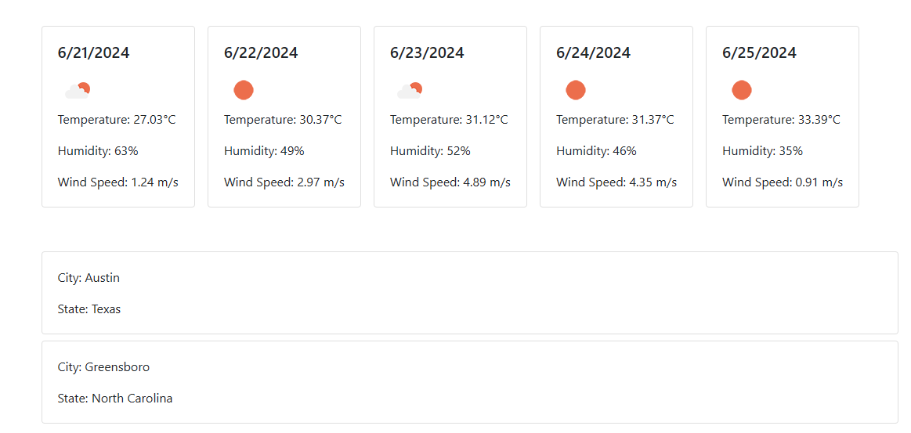

# Weather

This Weather Application uses the WeatherAPI to provide the current weather and a five-day forecast for a specified location.

## Features

- Fetches and displays the current weather.
- Fetches and displays a five-day weather forecast.

## Getting Started

1. Open the `index.html` file in your browser using a live server extension or any local server setup.
2. Enter the location for which you want to fetch the weather and forecast.

## Screenshot

